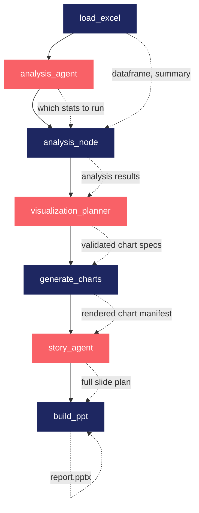

# Sheet2Slide

Turn a spreadsheet into a presentation, automatically.

Sheet2Slide reads an Excel or CSV file, analyzes it, decides what's worth
charting, and builds a finished PowerPoint deck — all through a LangGraph
pipeline with a local LLM making the analytical and design decisions along
the way.

---

## Pipeline



 **Deterministic tool nodes** — pandas/matplotlib/python-pptx, no LLM
 **LLM agent nodes** — local model decides, output is always validated

---

## Features

- **Automatic data analysis** — summary statistics, correlations, outlier
  detection, trend direction, and categorical breakdowns
- **Agent-driven chart selection** — an LLM picks the most informative
  chart types for *your* actual columns, validated before rendering so
  nothing breaks on a bad suggestion
- **Fully dynamic slide generation** — an LLM designs the deck itself:
  how many slides, what order, what layout, what story to tell
- **Runs locally** — uses [Ollama](https://ollama.com) and a small local
  model, no API keys or cloud calls required
- **Graceful degradation** — if the LLM returns something unusable, every
  step has a safe fallback so the pipeline still produces a complete deck

---

## Requirements

- Python 3.10+
- [Ollama](https://ollama.com) installed and running locally

---

## Setup

```bash
# 1. Install Python dependencies
pip install -r requirements.txt

# 2. Pull the local model used for analysis/chart/slide decisions
ollama pull qwen2.5:3b
```

---

## Usage

```bash
# Run on your own file
python3 main.py path/to/your_file.xlsx

# Or with no argument, uses the bundled sample dataset
python3 main.py
```

Supported input formats: `.xlsx`, `.xls`, `.xlsm`, `.csv`

On success:

```
Report generated: output/reports/report.pptx
```

On a missing or invalid file, you'll get a clear error message instead of
a stack trace.

---

## How it works

| Step | What happens |
|---|---|
| **load_excel** | Reads the file, infers column types, auto-detects date-like columns |
| **analysis_agent** | Decides which analysis categories are worth running for this dataset |
| **analysis_node** | Deterministic computation of stats, correlations, outliers, trends, categorical breakdowns — the LLM never touches the actual numbers |
| **visualization_planner** | Proposes charts using real column names and the analysis findings; every suggestion is validated against the data before acceptance |
| **generate_charts** | Matplotlib renders the validated chart specs to PNG |
| **story_agent** | Decides the full slide plan — count, order, layout, content — referencing only charts that were actually rendered |
| **build_ppt** | Renders the slide plan into a styled `.pptx` |

Every LLM-driven step is paired with deterministic validation: hallucinated
column names, bad chart types, and invalid slide references are filtered
out rather than crashing the run, and each step has a sensible fallback if
the model output can't be used at all.

---

## Project structure

```
Sheet2Slide/
├── main.py                          CLI entry point
├── requirements.txt
├── data/
│   └── sample.xlsx                  Example dataset
├── output/
│   ├── charts/                      Generated chart images
│   └── reports/                     Generated .pptx files
└── src/
    ├── state.py                     Shared LangGraph state schema
    ├── llm.py                       Local LLM (Ollama) configuration
    ├── graph.py                     Pipeline wiring (nodes + edges)
    │
    ├── models/                      Pydantic schemas for structured LLM output
    │   ├── analysis.py
    │   ├── visualization.py
    │   └── story.py
    │
    ├── tools/                       Deterministic logic — no LLM involved
    │   ├── excel_tools.py             Load file, summarize dataset
    │   ├── analysis_tools.py          Stats, correlation, outliers, trend, categorical
    │   └── chart_tools.py             Render validated chart specs to PNG
    │
    ├── agents/                      LLM-backed decision steps
    │   ├── analysis_agent.py          Which analysis to run
    │   ├── visualization_planner.py   Which charts to generate
    │   └── story_agent.py             How to structure the deck
    │
    ├── nodes/                       Thin LangGraph node wrappers around the above
    │   ├── load_excel.py
    │   ├── analysis.py
    │   ├── generate_charts.py
    │   └── ppt_builder.py
    │
    └── ppt/
        └── ppt_builder.py            Renders the final slide deck
```

---

## Customizing

**Add a new chart type**
1. Add a render branch in `src/tools/chart_tools.py` → `render_chart()`
2. Add it to the `ChartType` literal in `src/models/visualization.py`
3. Add a validation rule in `src/agents/visualization_planner.py` → `_validate_spec()`

**Add a new analysis category**
1. Add a function to `src/tools/analysis_tools.py`
2. Wire it into `run_analysis()`'s dispatcher
3. Add it to `VALID_CATEGORIES` in `src/agents/analysis_agent.py`

**Add a new slide layout**
1. Add a builder function in `src/ppt/ppt_builder.py`
2. Register it in `_LAYOUT_BUILDERS`
3. Add it to the `SlideLayout` literal in `src/models/story.py`
4. Describe it in the prompt inside `src/agents/story_agent.py`

**Use a different model** — change the `model` argument in `src/llm.py`.
Larger models will generally make better chart and slide decisions.

---

## Known limitations

- `qwen2.5:3b` is small and local; it occasionally returns malformed output
  or invents column names. This is expected and handled by validation —
  switching to a larger model will noticeably improve chart and slide
  quality.
- Trend detection is a simple heuristic (median of the first vs. last
  quarter of the data) — robust to a stray outlier, but it won't catch
  seasonality or multiple regime changes.
- Visual QA was done by rendering to images via LibreOffice; real
  PowerPoint may render minor details (like the stat-card shapes)
  slightly differently.